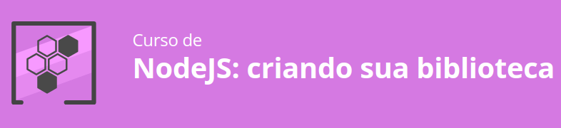

## Curso de NODE.js (Criando uma biblioteca)

Esta biblioteca acessa um arquivo de texto (markdow), procura dentro dele as urls e verifica se estão funcionais. Este projeto é baseado no curs NodeJS Criando sua biblioteca a ALURA.



### Primeiros Passos

1. Criação da pasta do projeto (lib-markdown)
2. Criação do arquivo index.js
3. Inicialização do projeto
    ```
    npm init -y
    ```
4. Instalação da biblioteca chalk
    ```
    npm install chalk
    ```
5. Criação da primeira função com o objetivo de retornar um texto
6. Inicialização do git no projeto e criação do arquivo .gitignore

### Importação de Arquivos locais

1. Utilização da lib fs responsável por ler um arquivo
2. Tratamento de erros
3. Trabalhando - then() | Promise() | async/await

### Selecionando os links do texto

1. Trabalhando com expressões regulares
2. Extraindo os links do texto
